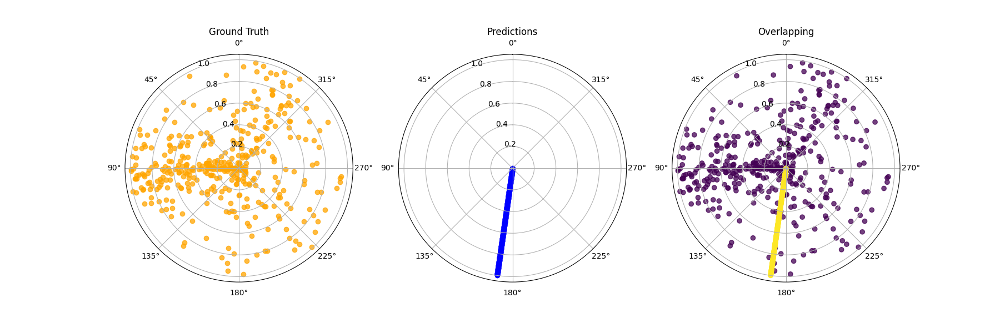
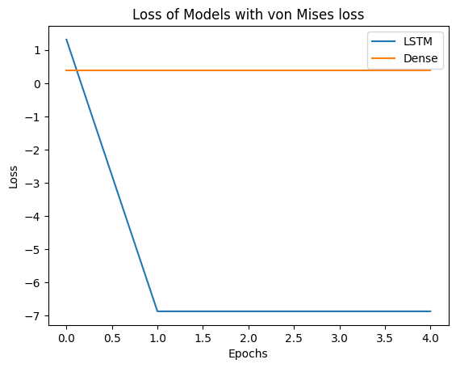
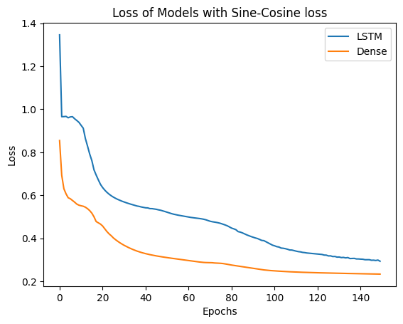

# UDL-Loss-Fitting
Repository for the SummerSemester 2025 Course "Understanding Deep Learning", at [University Osnabrück](https://www.uni-osnabrueck.de/)

# Data

We wanted to use data collected by the [Lower Saxon Ministry for the Environment, Energy and Climate Protection](https://www.umwelt.niedersachsen.de/startseite/) (Website in German). Lower Saxony maintains a network of weather stations to measure air quality (Lufthygienisches Überwachungssystem Niedersachsen) whose most recent data can be downloaded [from their website](https://www.umwelt.niedersachsen.de/startseite/themen/luftqualitat/lufthygienische_uberwachung_niedersachsen/aktuelle_messwerte_messwertarchiv/messwertarchiv/download/). The data we use was obtained by selecting the station "Osnabrück" - not the station "Osnabrück (VS)".

Then selecting the components  
- "Luftdruck" (barometric pressure), 
- "Windrichtung" (wind direction), and 
- "Windgeschw." (wind speed).

We selected "Stundenwerte" (hourly measurements) in the timeframe 12.02.2025 through 12.05.2025. The data was downloaded on 13.05.2025 at 00:01.

# Quickstart
## Create environment
You can create the environment needed for this project using the env_[].yml file.
We provided two environment files, one containing the neccessary cuda libraries , and one without. Replace the `[placeholder]` in the command with either `cuda` or `cpu`
```bash
$ conda env create -f env_[placeholder].yml python=3.11
```
After creating the environment, you can activate it using the following command:
```bash
$ conda activate udl-loss
```
## Execute Program
Once activated, navigate to the folder of the repository. Then you can execute the program using
```bash
$ python src/main.py [FLAGS]
```

## Flags
### `--model`
A flag for selecting the model to train on. Different flags also have an impact on how the data is prepared, as the LSTM models (lstm, circular) predict on sequences. The sequence length should be define in `cfg/cfg.yml` with the key "seq_len".\
Options:
- `dense` - A densly connected, strictly feed-forward model. Layers are as follows: 

- `lstm` - An LSTM network, designed to predict the direction of the wind using the last `seq_len` datapoints. Structure is as follows:


### `--loss`
This flag is selecting the loss to be used during training and testing. The different losses are explained in section [Losses](#explanation-of-losses).

Options:
- `mse` - The Mean Squared Error, as used in many state of the art networks. [Deviation from default implementation](#embedding-in-euclidian-space-mse)
- `vM` - A loss based on the von Mises distribution. [Explanation and derivation](#von-mises)


# Novelty in our Demo
The visualisation of the loss surface is done in a way that is not described in common literature. We refined already existing, but hard to read ones.

# Explanation of Losses

## von Mises

Since our model tries to predict the direction of wind, which is given on a circle, we are using the von Mises-Fischer Distribution. 
The von Mises Distribution is defined from $-\pi$ to $\pi$ in two dimensions (circle) as follows:

```math
\begin{align}
    f(x|\mu,\kappa) = \frac{\exp(\kappa\cos(x-\mu))}{2\pi I_0(\kappa)}
\end{align}
```

Since we want to predict the angle of the wind, we should focus on $\mu$. Replacing $\mu$ with our model results in:

```math
\begin{align}
    f(x|\mathbf{f\left[x_i, \phi\right]},\kappa) = \frac{\exp(\kappa\cos(x-\mathbf{f\left[x_i, \phi\right]}))}{2\pi I_0(\kappa)}
\end{align}
```

Taking the negative logarithm gives us:


```math
\begin{align}
    L[\mathbf{\phi}] &= \log\left(\frac{\exp(\kappa\cos(x-\mathbf{f\left[x_i, \phi\right]}))}{2\pi I_0(\kappa)}\right) \\
    
    &= \log\exp\left(\kappa\cos(x-\mathbf{f\left[x_i, \phi\right]})\right) - \log(2\pi I_0(\kappa)) \\
    &= \kappa\cos(x-\mathbf{f\left[x_i, \phi\right]}) - \log(2\pi I_0(\kappa))
\end{align}
```

Since the second term does not depend on $\mu$, it can be assumed constant and dropped. That leaves us with the final formula:
```math
\begin{align}
    L[\mathbf{\phi}] = \kappa\cos(x-\mathbf{f\left[x_i, \phi\right]})
\end{align}
```

In [our code](./src/loss.py#L34) this looks like the follows:
```python
@tf.function
def call(self, y_true, y_pred):
    y_true = tf.math.l2_normalize(y_true, axis = -1)
    y_pred = tf.math.l2_normalize(y_pred, axis = -1)

    # 1 - ... because cosine is already between -1 and 1,
    # thus this guarantees positivity.
    return 1 - self.kappa * tf.math.cos(y_true - y_pred)
```

## Cosine-Similarity

Another measurement that apparently should work is the Cosine-Similarity measurement. It measures how aligned two vectors are.
This is usually used in embedding spaces for LLMs. We thought we could use it as well, since the angle between two datapoints should be a good measurement on how good our network performs.

Cosine similarity between two vector is defined as follows:

```math
\begin{align}
\cos(\theta) = \frac{A \cdot B}{\Vert A\Vert \Vert B\Vert}
\end{align}
```
Where $\Vert A \Vert$ is the magnitude of the vector.
The code read as follows:

```python
@tf.function
def call(self, y_true, y_pred):
    # normalize 
    y_true = tf.norm(y_true, axis = -1)
    y_pred = tf.norm(y_pred, axis = -1)

    return tf.reduce_sum(tf.multiply(y_true, y_pred))
```
What I only realised after implementing that and trying to getting it to work, is that for having that working, a vector needs to be at least 2D. Which is not what we are predicting. We are predicting a singular value - the angle. \
After researching on how to circumevent that problem, I found that it is a common thing to transform an [angle to a vector](https://math.stackexchange.com/questions/180874/convert-angle-radians-to-a-heading-vector) on the unit circle. \
This directly leads to our next approach: 

## Embedding in Euclidian Space (MSE)

[This StackExchange post](https://math.stackexchange.com/questions/180874/convert-angle-radians-to-a-heading-vector) talks about transforming an angle with sine and cosine to a headings vector on the unit circle. On these two values the Mean Square Error can be applied to it. 
The same approach is also mentioned in [this article](https://medium.com/@john_96423/the-wraparound-problem-predicting-angles-in-machine-learning-44786aa51b91)

Noteable is that for the loss the two predictions get their own loss calculation respectively, which then get added.
Per default the implementation in tensorflow for MSE is taking the mean of the -1st axis. But since our prediction is of the shape [batch_size, 2], we would be taking the mean of the sine/cosine.
Our implementation uses the axis 0 instead, taking the mean of the batch and adding column one and two together.

[The implementation](./src/loss.py#L57) is as follows:

```python
@tf.function
def call(self, y_true, y_pred):
    return tf.math.reduce_sum(
        tf.math.reduce_mean(
            tf.math.square(y_true - y_pred),
            axis = self.axis
        ),
        axis = -1
    )
```

# Problems

Deep learning in itself is an optimsation problem of utmost complexity. In our problem we never got the network to remotely predict the data. Many different approaches were tried, using different losses and network structures.

Often the test predictions looked like this (datapoints have been numbered `1` to `n`, since they don't have a y value/speed anymore):

 

The loss during that drop off fast during the first epoch, but remained constant during the rest of the training.

 

The only thing we could remotely call success were using the [sine/cosine embedding](#embedding-in-euclidian-space-mse). Below the LSTM model:


The loss for both models also showed some significant improvements over the above von Mises loss.



Though sometimes we encounter the loss being stagnant and not capturing the data well. This happens in roughly 1/10th of the cases. We are fairly certain this depends on the initialisation, which means the problem is not consistently solveable. The data shown below sometimes is sometimes spreading out a bit, but not by a lot.


TODO: 

- play around with hyperparams of optimiser
- update env.yml