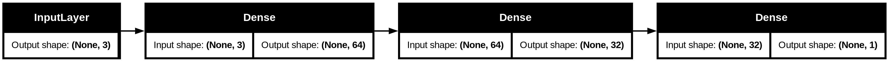
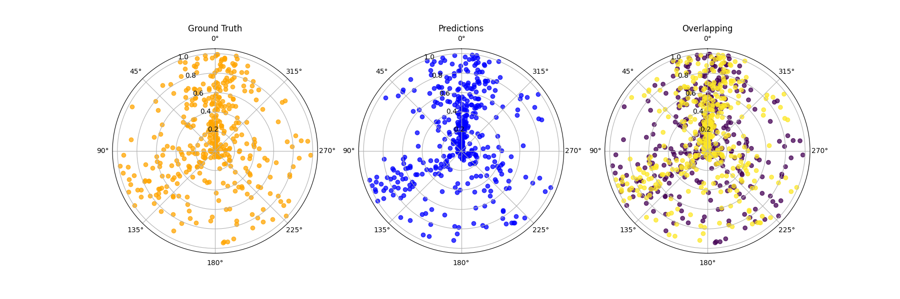

# UDL-Loss-Fitting
Repository for the SummerSemester 2025 Course "Understanding Deep Learning", at [University Osnabrück](https://www.uni-osnabrueck.de/)

# Project Structure
```
UDL-Loss-Fitting/
├── cfg/            # Configuration files
│   └── cfg.yml     
├── data/           # Dataset files
├── img/            # Images and visualizations
├── logs/           # Training and evaluation logs
├── src/            # Source code
│   ├── main.py     # Entry point for training & plotting
│   ├── loss.py     # Custom loss functions
│   ├── model.py    # Model architectures
│   ├── vis_loss.py # Loss surface visualisation
│   └── ...         # Other modules and utilities
├── env_cpu.yml     # Conda environment file (CPU)
├── env_cuda.yml    # Conda environment file (CUDA)
└── README.md       # Project documentation

```

# Quickstart
## Create environment
You can create the environment needed for this project using the `env_[].yml` file located in the root of the repository.
We provided two environment files, one containing the neccessary cuda libraries for training on a GPU, and one without. Replace the `[placeholder]` in the command with either `cuda` or `cpu`
```bash
$ conda env create -f env_[placeholder].yml
```
After creating the environment, you can activate it using the following command:
```bash
$ conda activate udl-loss
```
## Execute Program
Once activated, navigate to the folder of the repository. Then you can execute the program using
```bash
(udl-loss) $ python src/main.py [FLAGS]
```

## Flags
### `--model`
A flag for selecting the model to train on. Different flags also have an impact on how the data is prepared, as the LSTM models (lstm, circular) predict on sequences. The sequence length should be defined in `cfg/cfg.yml` with the key `seq_len`.

Options:
- `dense` - A densly connected, strictly feed-forward model. Layers are as follows: 

- `lstm` - An LSTM network, designed to predict the direction of the wind using the last `seq_len` (25 in this case) datapoints. Structure is as follows:


**Runtime**
When running the models on my local hardware (GPU with Cuda compute capability of 8.6), the runtimes were as follows (roughly)
| Model                | Loss | Epochs/sec |
|----------------------|:----:|:----------:|
| dense                | mse  | 0.21       |
| dense                | vm   | 14.3       |
| lstm (seq_len = 25)  | mse  | 7.69       |
| lstm (seq_len = 25)  | vm   | 7.59       |

### `--loss`
This flag is selecting the loss to be used during training and testing. The different losses are explained in section [Losses](#explanation-of-losses).

Options:
- `mse` - The Mean Squared Error, as used in many state of the art networks. [Slight deviation from default implementation here.](#embedding-in-euclidian-space-mse)
- `vM` - A loss based on the von Mises distribution. [Explanation and derivation here.](#von-mises)

### `--show-performance`
Optional flag. When set shows a nice visualisation of the model perfomance after training. Will look similar to the pictures in [#Problems](#problems)

## Novelty in our Demo
The visualisation of the loss surface is done in a way that is not described in common literature. We refined already existing, but hard to read ones.

# Data

We wanted to use data collected by the [Lower Saxon Ministry for the Environment, Energy and Climate Protection](https://www.umwelt.niedersachsen.de/startseite/) (Website in German). Lower Saxony maintains a network of weather stations to measure air quality (Lufthygienisches Überwachungssystem Niedersachsen) whose most recent data can be downloaded [from their website](https://www.umwelt.niedersachsen.de/startseite/themen/luftqualitat/lufthygienische_uberwachung_niedersachsen/aktuelle_messwerte_messwertarchiv/messwertarchiv/download/). The data we used was obtained by selecting the station "Osnabrück".

Selected Components:  
- "Luftdruck" (barometric pressure), 
- "Windrichtung" (wind direction), and 
- "Windgeschw." (wind speed).

We selected hourly measurements ("Stundenwerte") in the timeframe 12.02.2025 through 12.05.2025. The data was downloaded on 13.05.2025 at 00:01.

# Explanation of Losses

## von Mises

Since our model tries to predict the direction of wind, which is given on a circle, we are using the von Mises Distribution as our base, and construct the negative log-likelihood from it.

The von Mises Distribution is defined from $-\pi$ to $\pi$ in two dimensions (circle) as follows:

```math
\begin{align}
    f(x|\mu,\kappa) = \frac{\exp(\kappa\cos(x-\mu))}{2\pi I_0(\kappa)}
\end{align}
```

Since we want to predict the angle of the wind, we should focus on the mean parameter $\mu$. $\kappa$ dictates the spread from the mean. 
Replacing $\mu$ with our model results in:

```math
\begin{align}
    f(x|\mathbf{f\left[x_i, \phi\right]},\kappa) = \frac{\exp(\kappa\cos(x-\mathbf{f\left[x_i, \phi\right]}))}{2\pi I_0(\kappa)}
\end{align}
```

Taking the negative logarithm gives us:


```math
\begin{align}
    L[\mathbf{\phi}] &= \log\left(\frac{\exp(\kappa\cos(x-\mathbf{f\left[x_i, \phi\right]}))}{2\pi I_0(\kappa)}\right) \\
    
    &= \log\exp\left(\kappa\cos(x-\mathbf{f\left[x_i, \phi\right]})\right) - \log(2\pi I_0(\kappa)) \\
    &= \kappa\cos(x-\mathbf{f\left[x_i, \phi\right]}) - \log(2\pi I_0(\kappa))
\end{align}
```

Since the second term does not depend on $\mu$, it can be assumed constant and dropped. That leaves us with the final formula:
```math
\begin{align}
    L[\mathbf{\phi}] = \kappa\cos(x-\mathbf{f\left[x_i, \phi\right]})
\end{align}
```

In [our code](./src/loss.py#L35) this looks like the follows:
```python
@tf.function
def call(self, y_true, y_pred):
    y_true = tf.math.l2_normalize(y_true, axis = -1)
    y_pred = tf.math.l2_normalize(y_pred, axis = -1)

    return tf.reduce_mean( - self.kappa * tf.math.cos(y_true - y_pred))
```

## Cosine-Similarity

Another measurement that apparently should work is the Cosine-Similarity measurement. It measures how aligned two vectors are.
This is usually used in embedding spaces for LLMs. We thought we could use it as well, since the angle between two datapoints should be a good measurement on how good our network performs.

Cosine similarity between two vector is defined as follows:

```math
\begin{align}
\cos(\theta) = \frac{A \cdot B}{\Vert A\Vert \Vert B\Vert}
\end{align}
```
Where $\Vert A \Vert$ is the magnitude of the vector.
The code read as follows:

```python
@tf.function
def call(self, y_true, y_pred):
    # normalize 
    y_true = tf.norm(y_true, axis = -1)
    y_pred = tf.norm(y_pred, axis = -1)

    return tf.reduce_sum(tf.multiply(y_true, y_pred))
```
What I only realised after implementing that and trying to getting it to work, is that for having that working, a vector needs to be at least 2D. Which is not what we are predicting. We are predicting a singular value - the angle. \
After researching on how to circumevent that problem, I found that it is a common thing to transform an [angle to a vector](https://math.stackexchange.com/questions/180874/convert-angle-radians-to-a-heading-vector) on the unit circle. \
This directly leads to our next approach: 

## Embedding in Euclidian Space (MSE)

[This StackExchange post](https://math.stackexchange.com/questions/180874/convert-angle-radians-to-a-heading-vector) talks about transforming an angle with sine and cosine to a headings vector on the unit circle. On these two values the Mean Square Error can be applied to it. 
The same approach is also mentioned in [this article](https://medium.com/@john_96423/the-wraparound-problem-predicting-angles-in-machine-learning-44786aa51b91)

Noteable is that for the loss the two predictions get their own loss calculation respectively, which then get added.

```math
\begin{align}
    L[\mathbf{\phi}] = MSE(\sin(\theta)) + MSE(\cos(\theta))
\end{align}
```

[The implementation](./src/loss.py#L57) of the MSE is very similar, but not identical to the standard implementation. The axis can be defined:

```python
@tf.function
def call(self, y_true, y_pred):
    return tf.math.reduce_mean(
            tf.math.square(y_true - y_pred),
            axis = self.axis
        )
```

# Visualisations
Equipped with all the losses, we can now train our network and have a look at fancy looking graphs.

## The Loss Surface

The loss surface of a neural network is a graph, depending on all of the networks parameters (weights) and the loss associated with the state of the network. 
Since this surface depends on all parameters of a network, it lives in a space of `#parameters` dimensions. 
In our case it is 137 314 dimensions for the `LSTM` model, and 2 402 dimensions for the `Dense` model.

This in itself is the big hurdle to overcome in order to be able to plot loss surfaces, since in visualisations we are restricted to at most 3 dimensions.
Our approach was to project the state of the model after training into two dimensions, and then calculate a grid from there to get to a landscape (here of the LSTM model with MSE):


We took inspiration from the paper [Visualizing the Loss Landscape of Neural Nets](https://doi.org/10.48550/arXiv.1712.09913) [1], and tried to adapt their simple approach to the plotting.
[This post](https://mathformachines.com/posts/visualizing-the-loss-landscape/) helped understanding the paper even better.


## The Optimisation Path on the Loss Surface

To show the part of the loss surface, on which the model performs the optimisation, we did a PC-Analysis on the weights of the model during training. 
This gave us roughly the section that is relevant, and the anchor for which we calculated the grid. [src/vis_loss.py](./src/vis_loss.py#L267)

```python
# Vectorize network weights
weight_matrix = paramlist_to_matrix(training_path)

# Create components
pca = skd.PCA(
    n_components = n_components,
    whiten = True
)
components = pca.fit_transform(weight_matrix)
```

And scattering that on the surface looks like this (this time the Dense model with MSE):


The path is drawn before the surface, and I could not find a way to always draw it after the surface, especially since I had to turn the figure around to have a nice view.  


### Problems with the Optimisation Path

We initially wanted to use the real loss values the network calculated during its training.
But unfortunately, no matter how hard we tried, we could not get them to align to be on the surface.

```python
# calculate the actual loss
z_loss = np.empty(shape = (len(path),), dtype = np.float32)

for i, pth in enumerate(tqdm.tqdm(path)):
    self.model_.set_weights(coords(*pth))
    z_loss[i] = self.model_.test_on_batch(
        self.inputs_, 
        self.outputs_, 
        return_dict = True
    )["loss"]
```

We then decided to instead just project them on the surface, losing some truth, but making for a prettier picture.
For that we used Bilinear Interpolation. [src/vis_loss.py](./src/vis_loss.py#L157)
```python
interpolator = RegularGridInterpolator(
    (X, Y),
    Z.T
)
z_loss_grid = interpolator(path)
```


# Problems

While the models usually learn really well, sometimes we encountered the loss being stagnant and not capturing the data well. As this is not always the case, but only on some relatively rare occasions, we think this has to do with the initialisation. But just to be sure you are aware of this, this is how the loss and the predictions might look like.


The loss values have been recorded during training and can be accessed as csvs in the `logs` directory. Graphic has been obtained by executing `logs/vis_logs.py`

The predictions have been drawn from sample `1-n`, since they are only coded in angles, and this makes for the best visualisation. (Obtained by `--show-performance`)


Just for comparison, this is how a "good" prediction would look like:




# Copilot usage disclaimer
GitHub Copilot has been used in this project for the following purposes:

- Suggestions for Documentation
- Giving explanation on code snippets
- Support with arising bugs

The idea and the work on the code itself is the work of the contributors to this repository.


# Sources

[1] Li, H., Xu, Z., Taylor, G., Studer, C., & Goldstein, T. (2017). Visualizing the loss landscape of neural nets. *arXiv (Cornell University)*. https://doi.org/10.48550/arxiv.1712.09913
